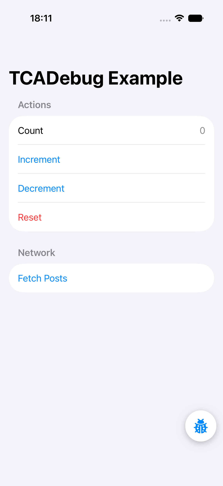
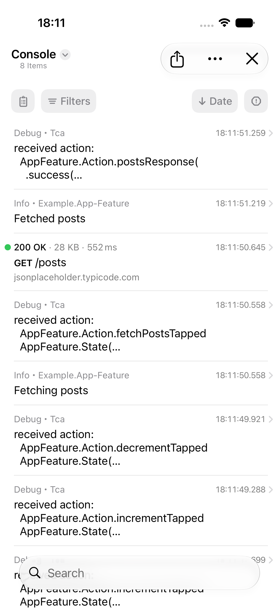
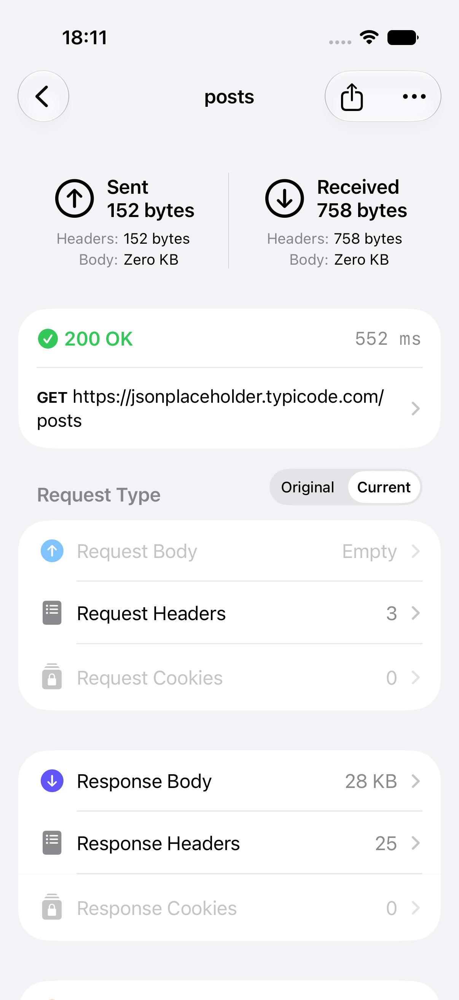
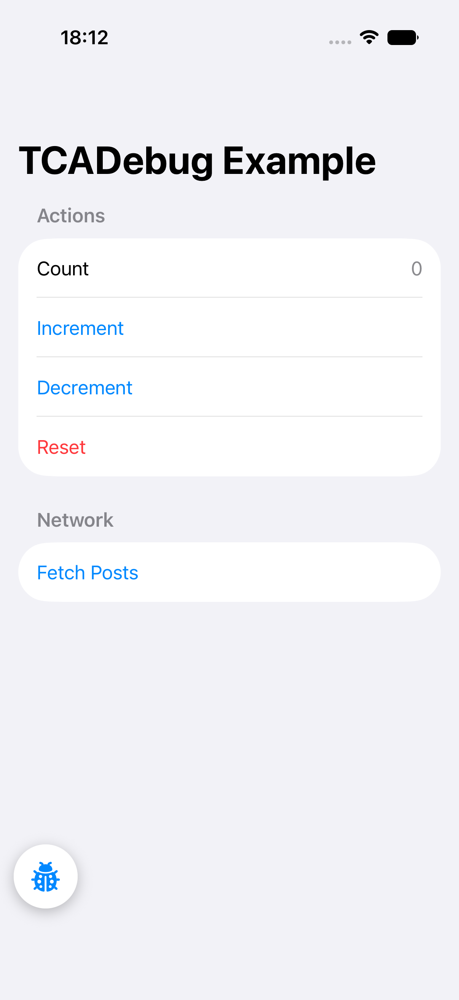

# swift-tca-debug

An in-app debugging toolkit for [Composable Architecture](https://github.com/pointfreeco/swift-composable-architecture) apps:

- **TCA action & state logging** through [swift-log](https://github.com/apple/swift-log), via a `Reducer` extension.
- **A Pulse-backed log pipeline** — a public swift-log `LogHandler` writing into [Pulse](https://github.com/kean/Pulse)'s `LoggerStore`.
- **An in-app debug console** — PulseUI's `ConsoleView`, which expands full-screen out of a draggable, corner-snapping floating button (iOS 18 zoom transition).
- **Network traffic capture** — opt-in `URLSession` logging for the console's network view.

## Usage

```swift
import ComposableArchitecture
import Logging
import TCADebug

@main
struct MyApp: App {
  init() {
    #if DEBUG
    TCADebug.bootstrap()              // swift-log → Pulse
    TCADebug.enableNetworkLogging()   // URLSession traffic → Pulse
    #endif
  }

  static let store = Store(initialState: AppFeature.State()) {
    #if DEBUG
    AppFeature().debugLog(Logger(label: "tca"))
    #else
    AppFeature()
    #endif
  }

  var body: some Scene {
    WindowGroup {
      AppView(store: Self.store)
        #if DEBUG
        .debugConsoleOverlay()        // floating button → console
        #endif
    }
  }
}
```

### Customizing the reducer log

```swift
AppFeature().debugLog(
  DebugLogConfiguration(
    logger: logger,
    level: .info,
    logStateDiffs: false,                       // cheap, action-only mode
    format: { action, diff in "→ \(action)" }   // or replace the format entirely
  )
)
```

### Composing with an existing logging setup

`LoggingSystem.bootstrap` may run once per process. If your app already bootstraps
swift-log, compose the handler instead of calling `TCADebug.bootstrap()`:

```swift
LoggingSystem.bootstrap { label in
  MultiplexLogHandler([
    PulseLogHandler(label: label),
    StreamLogHandler.standardOutput(label: label),
  ])
}
```

### Presenting the console manually

```swift
.sheet(isPresented: $isConsolePresented) {
  DebugConsoleView { isConsolePresented = false }
}
```

### Network logging without swizzling

`TCADebug.enableNetworkLogging()` is the fastest debug-only path because it uses
PulseProxy to capture all `URLSession` traffic, including `URLSession.shared`.
Production-cautious apps can instead inject an explicitly owned Pulse session:

```swift
import Pulse

#if DEBUG
let session: URLSessionProtocol = URLSessionProxy(configuration: .default)
#else
let session: URLSessionProtocol = URLSession(configuration: .default)
#endif
```

For delegate-based sessions, wrap your delegate with `URLSessionProxyDelegate`.
Avoid `URLSessionProxyDelegate.enableAutomaticRegistration`; it is broader, older,
and does not cover async/await convenience APIs as well as an injected session.

## Migration

| Before | After |
|---|---|
| `import TCASwiftLog` + `import PulseLogHandler` | `import TCADebug` |
| `LoggingSystem.bootstrap(PersistentLogHandler.init)` | `TCADebug.bootstrap()` |
| `Feature()._printChanges(.swiftLog(label:))` | `Feature().debugLog(logger)` |
| Embedded `ConsoleView(store: .shared)` tab | `.debugConsoleOverlay()` or `DebugConsoleView` |

## Troubleshooting

| Symptom | Check |
|---|---|
| Console opens but shows no app logs | Make sure `TCADebug.bootstrap()` runs once at app start, or manually include `PulseLogHandler` in your existing `LoggingSystem.bootstrap` setup. |
| Reducer actions print elsewhere but not in Pulse | Pass a `Logger` whose handler is routed to Pulse, then compose the reducer with `.debugLog(logger)`. |
| Reducer logs disappear after changing `DebugLogConfiguration.level` | Set the logger's own `logLevel` to the configured level or lower; swift-log still filters messages before handlers see them. |
| Network tab is empty | Call `TCADebug.enableNetworkLogging()` in debug builds before requests start, or route requests through an injected `URLSessionProxy`. |

## Example app

`Example/` contains a small Tuist-generated demo (counter actions + a real API request)
with the full integration: bootstrap, reducer logging, network capture, and the
floating console button.

```bash
cd Example
mise install        # pins tuist
tuist generate      # generates Example.xcworkspace (nothing generated is committed)
```

| Demo | Console (TCA logs) | Network detail | After drag |
|---|---|---|---|
|  |  |  |  |

These screenshots are produced by the `ExampleUITests` XCUITest suite (page objects via
[swift-xcui-page-macros](https://github.com/mehmetbaykar/swift-xcui-page-macros)) and exported
with `Scripts/export-screenshots.sh` — the same job CI uploads as an artifact.

## Platform support

| Platform | Logging | Console + floating button |
|---|---|---|
| iOS / iPadOS 18+ | ✓ | ✓ (drag + tap-to-open) |
| visionOS 2+ | ✓ | — (PulseUI 5.2.x does not compile for visionOS — its Liquid Glass path calls `glassEffect`, which the visionOS SDK marks unavailable; inspect the shared store with the [Pulse mac app](https://pulselogger.com)) |
| tvOS 18+ | ✓ | ✓ (tap-to-open; no drag) |
| watchOS 11+ | ✓ | ✓ (Pulse's minimal watch console) |
| macOS 15+ | ✓ | — (PulseUI ships no macOS console; inspect the shared store with the [Pulse mac app](https://pulselogger.com)) |

## A word of warning

Action and state dumps can contain user data, and an open debug console in an App
Store build is a review and privacy risk. Gate every integration point behind
`#if DEBUG` (or your internal-distribution flag); the `format` hook is the place to
redact sensitive state. Network capture uses Pulse's swizzling-based proxy and is
likewise intended for debug builds only.